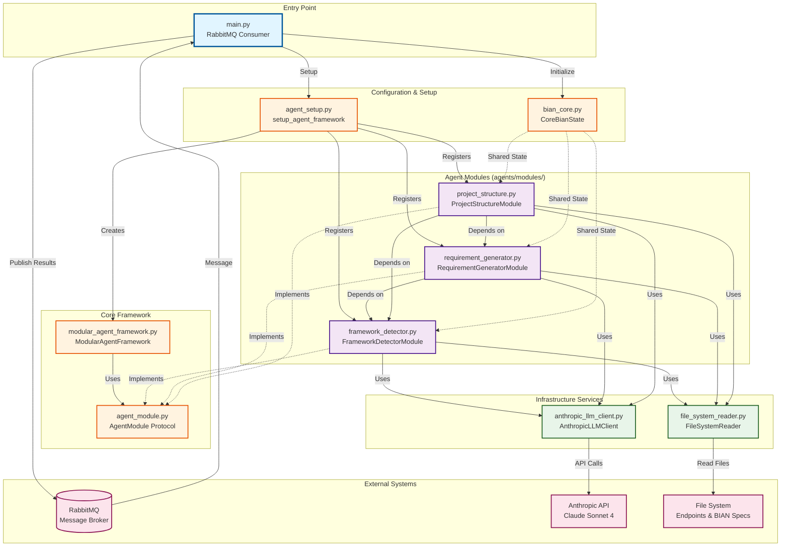
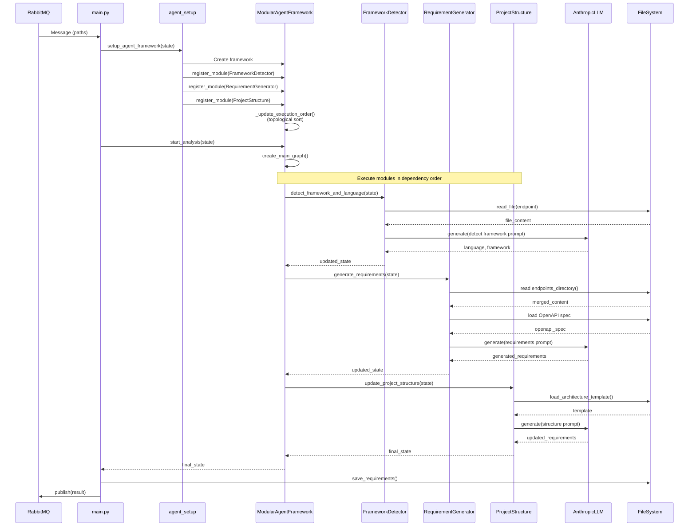
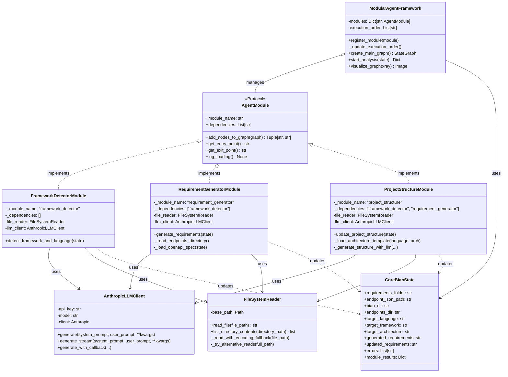
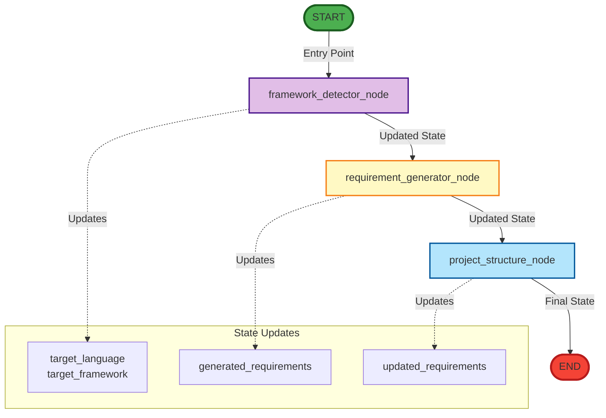
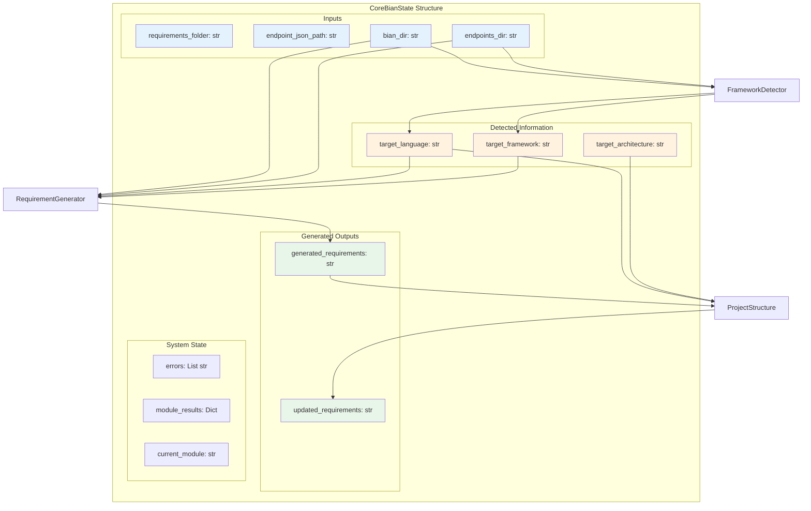

# Diagrama de Arquitectura del Proyecto BIAN

## Diagrama Completo del Sistema



## Diagrama de Flujo de Ejecución



## Diagrama del Sistema de Módulos



## Diagrama de Dependencias entre Módulos

```mermaid
graph LR
    subgraph "Module Dependency Chain"
        FD[FrameworkDetector<br/>dependencies: []]
        RG[RequirementGenerator<br/>dependencies: ['framework_detector']]
        PS[ProjectStructure<br/>dependencies: ['framework_detector', 'requirement_generator']]
    end

    FD -->|1. Execute First| RG
    RG -->|2. Execute Second| PS
    PS -->|3. Execute Last| END[END]

    style FD fill:#c8e6c9,stroke:#2e7d32
    style RG fill:#fff9c4,stroke:#f57f17
    style PS fill:#b3e5fc,stroke:#0277bd
    style END fill:#ffccbc,stroke:#d84315
```

## Diagrama del Grafo LangGraph Generado



## Diagrama de Datos - CoreBianState



## Descripción de Componentes

### 1. **ModularAgentFramework**
- **Responsabilidad**: Orquestador central del sistema
- **Funciones clave**:
  - Registra módulos dinámicamente
  - Ordena ejecución basándose en dependencias (topological sort)
  - Crea y compila el grafo de LangGraph
  - Ejecuta el pipeline completo

### 2. **AgentModule (Protocol)**
- **Responsabilidad**: Interfaz que todos los módulos deben implementar
- **Garantiza**:
  - Cada módulo declara su nombre único
  - Cada módulo declara sus dependencias
  - Cada módulo puede añadir nodos al grafo
  - Cada módulo tiene puntos de entrada/salida

### 3. **Módulos Concretos**

#### a) **FrameworkDetectorModule**
- **Sin dependencias**
- **Función**: Detecta lenguaje y framework del código fuente
- **Input**: Archivos en `endpoints_dir`
- **Output**: `target_language`, `target_framework`

#### b) **RequirementGeneratorModule**
- **Depende de**: `framework_detector`
- **Función**: Genera requisitos analizando endpoints y especificación OpenAPI
- **Input**: Archivos de endpoints, especificación BIAN JSON
- **Output**: `generated_requirements`

#### c) **ProjectStructureModule**
- **Depende de**: `framework_detector`, `requirement_generator`
- **Función**: Actualiza estructura del proyecto usando templates de arquitectura
- **Input**: Requirements generados, templates de arquitectura
- **Output**: `updated_requirements`

### 4. **Servicios de Infraestructura**

#### a) **AnthropicLLMClient**
- Cliente para API de Anthropic Claude
- Soporta generación con streaming
- Manejo de tokens y temperatura configurable

#### b) **FileSystemReader**
- Lee archivos con múltiples encodings (UTF-8, Latin-1)
- Soporte para rutas largas en Windows
- Métodos alternativos de lectura para casos edge

### 5. **Flujo de Ejecución**
1. RabbitMQ recibe mensaje con rutas
2. `main.py` crea estado inicial
3. `agent_setup.py` configura framework y módulos
4. Framework ordena módulos por dependencias
5. Se crea grafo LangGraph con todos los nodos
6. Ejecución secuencial: FD → RG → PS
7. Guardado de resultados y publicación a RabbitMQ
