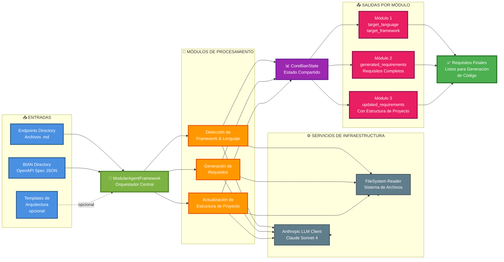
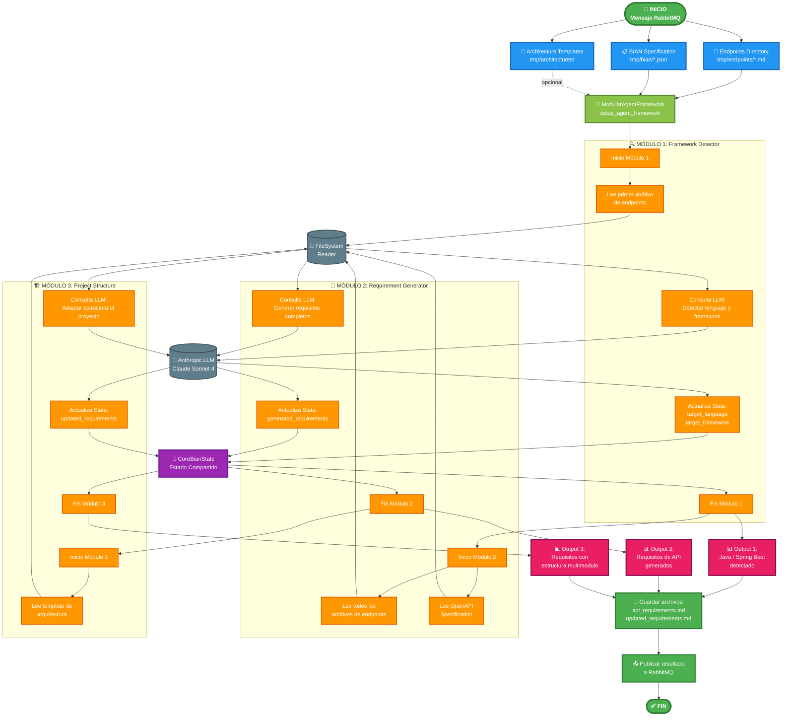
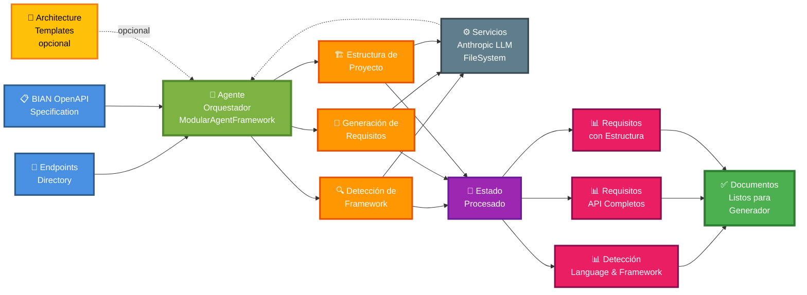

# Diagrama de Flujo del Sistema BIAN - Análisis y Generación de Requisitos

## Flujo Principal del Sistema

## Flujo Detallado con Secuencia de Ejecución

## Diagrama Simplificado al Estilo del Original

## Descripción del Flujo

### 📥 **Fase 1: ENTRADAS**
1. **Endpoints Directory** (`tmp/endpoints/*.md`): Archivos con descripción de endpoints
2. **BIAN OpenAPI Specification** (`tmp/bian/*.json`): Especificación formal de la API
3. **Architecture Templates** (`tmp/architectures/`): Templates opcionales de estructura de proyecto

### 🎯 **Fase 2: ORQUESTACIÓN**
El **ModularAgentFramework** coordina la ejecución de los módulos en orden de dependencias:
- Registra todos los módulos
- Realiza ordenamiento topológico
- Crea el grafo de ejecución de LangGraph
- Ejecuta el pipeline completo

### 🔧 **Fase 3: PROCESAMIENTO (3 Módulos)**

#### 🔍 **Módulo 1: Framework Detector**
- **Dependencias**: Ninguna
- **Entrada**: Primer archivo de endpoints
- **Proceso**:
  - Lee archivo con FileSystemReader
  - Consulta Anthropic LLM para detectar lenguaje y framework
  - Actualiza `target_language` y `target_framework` en el estado
- **Salida**: Java, Spring Boot, Python, etc.

#### 📝 **Módulo 2: Requirement Generator**
- **Dependencias**: Framework Detector
- **Entrada**:
  - Todos los archivos de endpoints
  - OpenAPI specification
  - Lenguaje y framework detectados
- **Proceso**:
  - Lee y fusiona todos los endpoints
  - Carga especificación OpenAPI
  - Consulta LLM para generar requisitos completos
  - Actualiza `generated_requirements` en el estado
- **Salida**: Documento de requisitos completo en markdown

#### 🏗️ **Módulo 3: Project Structure**
- **Dependencias**: Framework Detector, Requirement Generator
- **Entrada**:
  - Requisitos generados
  - Template de arquitectura (según lenguaje detectado)
- **Proceso**:
  - Carga template de arquitectura apropiado
  - Consulta LLM para adaptar estructura al proyecto
  - Reemplaza sección de estructura en requisitos
  - Actualiza `updated_requirements` en el estado
- **Salida**: Requisitos con estructura de proyecto definida

### ⚙️ **Fase 4: SERVICIOS DE INFRAESTRUCTURA**
- **Anthropic LLM Client**: Realiza todas las consultas a Claude Sonnet 4
- **FileSystem Reader**: Maneja lectura de archivos con múltiples encodings

### 💾 **Fase 5: ESTADO COMPARTIDO**
**CoreBianState** mantiene:
- Rutas de entrada
- Información detectada (lenguaje, framework, arquitectura)
- Requisitos generados en cada paso
- Errores y resultados por módulo

### 📊 **Fase 6: SALIDAS POR MÓDULO**
Cada módulo contribuye con información específica al estado compartido:
1. **Detección**: `target_language`, `target_framework`
2. **Requisitos**: `generated_requirements`
3. **Estructura**: `updated_requirements`

### ✅ **Fase 7: SALIDA FINAL**
- **api_requirements.md**: Requisitos generados por el módulo 2
- **updated_requirements.md**: Requisitos finales con estructura de proyecto
- **Publicación a RabbitMQ**: Notificación al siguiente servicio en la cadena
