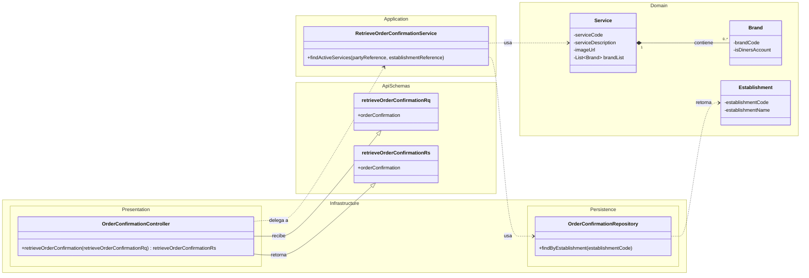

# Diagrama de Arquitectura y Clases del Proyecto

Este diagrama ilustra la arquitectura multi-módulo del proyecto (Domain-Driven Design) y cómo los componentes de la API se relacionan entre sí.

### Explicación del Diagrama

1.  **Namespaces (Módulos)**: El diagrama está dividido en `Infrastructure`, `Application` y `Domain` para reflejar la arquitectura multi-módulo. Los esquemas de la API están en su propio namespace `ApiSchemas` para mayor claridad.
2.  **Flujo de la Petición**:
    - La petición llega al `OrderConfirmationController` en la capa de `Infrastructure`. Este controlador recibe un objeto `retrieveOrderConfirmationRq`.
    - El controlador no contiene lógica de negocio. En su lugar, **delega** la tarea al `RetrieveOrderConfirmationService` en la capa de `Application`.
    - El servicio de aplicación orquesta la operación. Para ello, utiliza el `OrderConfirmationRepository` (en `Infrastructure`) para obtener datos de la base de datos (como la información del `Establishment`).
    - También utiliza los objetos del `Domain` (como `Service` y `Brand`) para aplicar las reglas de negocio necesarias.
    - Finalmente, el `Controller` construye y devuelve la respuesta `retrieveOrderConfirmationRs`.
3.  **Relaciones**:
    - Las líneas punteadas (`..>`) indican una relación de **uso** (dependencia).
    - Las líneas con una flecha triangular (`--|>`) indican que una clase **utiliza o se conforma a** otra (en este caso, el controlador usa los DTOs de la API).
    - La línea con un diamante (`*--`) indica **composición**, donde `Service` contiene una lista de `Brand`.

Este diagrama te da una visión completa de "todo eso": la estructura del código, los objetos de datos de la API y cómo interactúan entre sí para cumplir con la funcionalidad de negocio.<!--
[PROMPT_SUGGESTION]Ahora, genera el código Java para la clase `OrderConfirmationController` en la capa de infraestructura.[/PROMPT_SUGGESTION]
[PROMPT_SUGGESTION]Explícame en detalle la diferencia entre la capa de Aplicación y la capa de Dominio en esta arquitectura.[/PROMPT_SUGGESTION]
